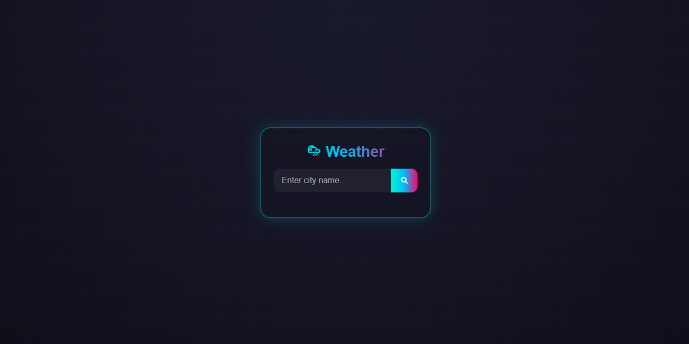
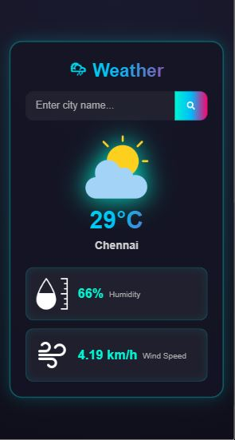
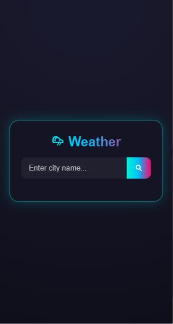

#  Weather App

A minimalist and responsive **Weather Application** built with React.  
Quickly fetch current weather data for any location with a clean UI.

##  Live Demo  
👉 [View it on Netlify](https://weather-app-simple1.netlify.app/)

##  Features  
-  Search weather by city name  
-  Current temperature, humidity, wind speed, and weather icon display  
-  Background themes change based on weather (sunny, rainy, cloudy, etc.)  
-  Responsive design—mobile and desktop friendly

##  Tech Stack  
- React.js  
- CSS Modules or styled-components  
- OpenWeatherMap API (or any weather API of your choice)

##  Screenshot  
  
  
  


##  Installation & Setup  
```bash
git clone https://github.com/Vallarasu-KSG/simple-weather-app
cd weather-app
npm install
npm start
