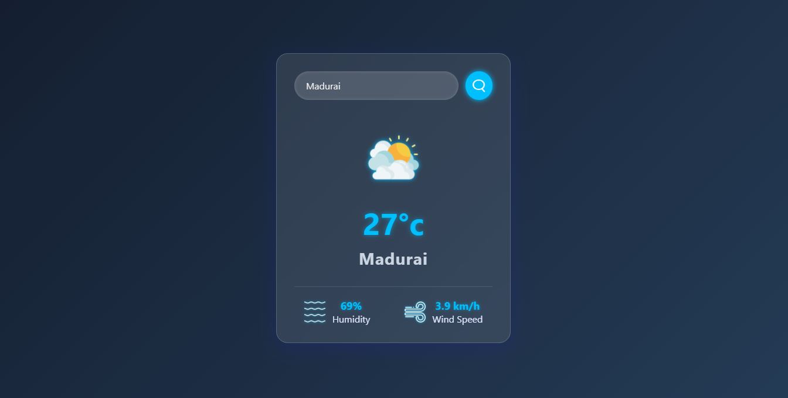

# 🌦️ Simple Weather App

A clean and simple weather app built using **HTML, CSS, and JavaScript**. This app allows users to get the current weather of any city by entering the city name.

🔗 **Live Demo**: [Click here to view](https://vallarasu-ksg.github.io/simple-weather-app/)

---

## 🚀 Features

- 🌍 Get real-time weather of any city
- 📦 Uses OpenWeatherMap API
- 🌡️ Displays temperature, humidity, wind speed, and weather status
- 🖥️ Responsive and clean UI design

---

## 🛠️ Technologies Used

- HTML5
- CSS3
- Vanilla JavaScript
- [OpenWeatherMap API](https://openweathermap.org/api)

---

## 📸 Screenshot

> *(Add your screenshot here)*  
You can take a screenshot of your live site and upload it with this filename: `images/Weather_Screenshot.JPG` and use this markdown:

```markdown

